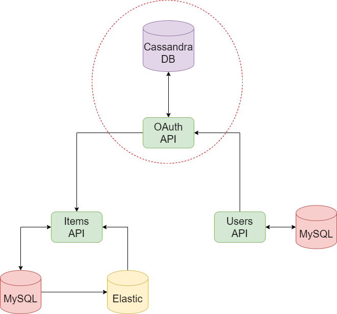
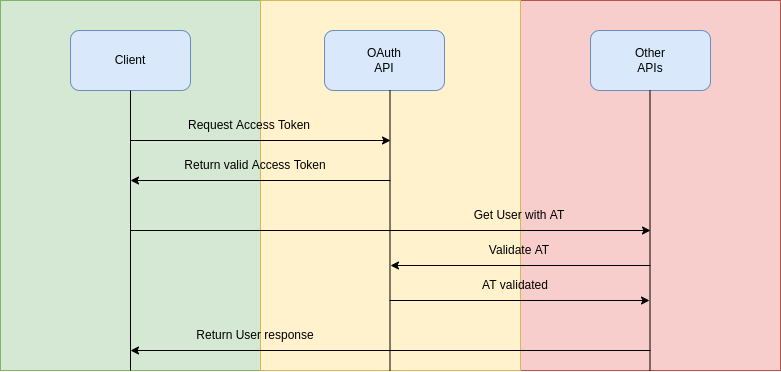

# Bookstore OAuth API
 
A Golang microservice that will be used as an OAuth API to centralize authentication.

## Architecture



## How it works



This service will work as a security layer for other services, basic all requisition will need a token that will be generated and used by the client to make requests to others APIs, these APIs will send a request back to our OAuth in order to verify if this token is valid.

## Requirements

### Standalone

* [Cassandra](https://cassandra.apache.org/_/index.html)

### Running a container

* [Docker](https://docs.docker.com/get-docker/)
* [Cassandra image](https://hub.docker.com/_/cassandra)

## Before running

This app collect some data from env, bellow you can find a list of all vars and their values:

|         Variable          |    Description    |
|:-------------------------:|:-----------------:|
|   cassandra_oauth_host    |   Database URL    |
| cassandra_oauth_keyspace  | Database Keyspace |

Inside this folder you will find a file called *migration.cql*, run it in your database.

### Creating the container

While the same folder of Dockerfile, run:

``` shell
docker build --tag bookstore_oauth-api:latest .
```

## Running

``` shell
go run *.go
```

### Running as container

Starting Cassandra container:

``` shell
docker run --name cassandra --network host -d cassandra:latest
```

Remember to run *migration.cql* in your database

Starting the app

``` shell
docker run -ti --network host -e cassandra_oauth_host=127.0.0.1 -e cassandra_oauth_keyspace=oauth bookstore_oauth-api:latest
```

## API

### /oauth/

|   Function   | Method |     Path      | Expected |
|:------------:|:------:|:-------------:|:--------:|
|  Get token   |  GET   | /{token_name} |  String  |
| Create token |  POST  |       /       |   JSON   |
| Update token |  PUT   | /{token_name} |  String  |


#### Create Token

return a token

``` json
{
    "access_token": "abc123",
    "user_id": 1,
    "client_id": 2,
    "expires": 123
}
```

#### Update Token

* TBD

## TODO

* Create deployment for K8s

## Credits

This microservice is based in this [course](https://www.udemy.com/course/golang-how-to-design-and-build-rest-microservices-in-go/)